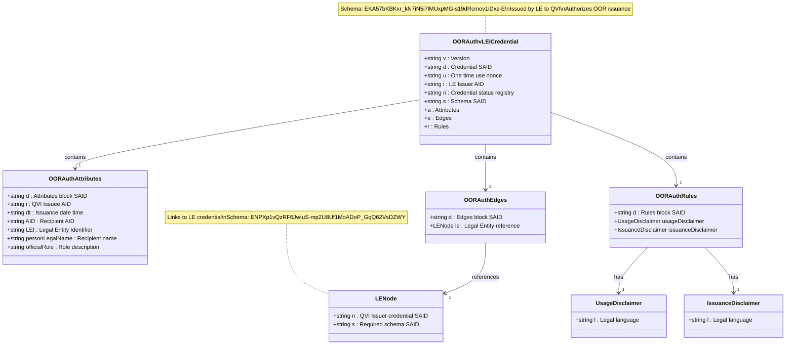
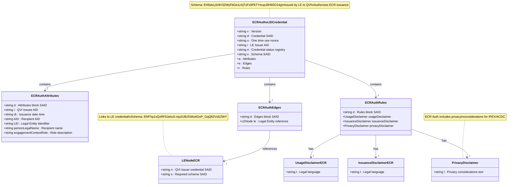

# Authorization vLEI Credential Schemas

## OOR Authorization vLEI Credential

```mermaid
classDiagram
    class OORAuthvLEICredential {
        +string v : Version
        +string d : Credential SAID
        +string u : One time use nonce
        +string i : LE Issuer AID
        +string ri : Credential status registry
        +string s : Schema SAID
        +a : Attributes
        +e : Edges
        +r : Rules
    }

    class OORAuthAttributes {
        +string d : Attributes block SAID
        +string i : QVI Issuee AID
        +string dt : Issuance date time
        +string AID : Recipient AID
        +string LEI : Legal Entity Identifier
        +string personLegalName : Recipient name
        +string officialRole : Role description
    }

    class OORAuthEdges {
        +string d : Edges block SAID
        +LENode le : Legal Entity reference
    }

    class LENode {
        +string n : QVI Issuer credential SAID
        +string s : Required schema SAID
    }

    class OORAuthRules {
        +string d : Rules block SAID
        +UsageDisclaimer usageDisclaimer
        +IssuanceDisclaimer issuanceDisclaimer
    }

    class UsageDisclaimer {
        +string l : Legal language
    }

    class IssuanceDisclaimer {
        +string l : Legal language
    }

    OORAuthvLEICredential --> "1" OORAuthAttributes : contains
    OORAuthvLEICredential --> "1" OORAuthEdges : contains
    OORAuthvLEICredential --> "1" OORAuthRules : contains
    OORAuthEdges --> "1" LENode : references
    OORAuthRules --> "1" UsageDisclaimer : has
    OORAuthRules --> "1" IssuanceDisclaimer : has

    note for OORAuthvLEICredential "Schema: EKA57bKBKxr_kN7iN5i7lMUxpMG-s19dRcmov1iDxz-E\nIssued by LE to QVI\nAuthorizes OOR issuance"
    
    note for LENode "Links to LE credential\nSchema: ENPXp1vQzRF6JwIuS-mp2U8Uf1MoADoP_GqQ62VsDZWY"
```

## ECR Authorization vLEI Credential

```mermaid
classDiagram
    class ECRAuthvLEICredential {
        +string v : Version
        +string d : Credential SAID
        +string u : One time use nonce
        +string i : LE Issuer AID
        +string ri : Credential status registry
        +string s : Schema SAID
        +a : Attributes
        +e : Edges
        +r : Rules
    }

    class ECRAuthAttributes {
        +string d : Attributes block SAID
        +string i : QVI Issuee AID
        +string dt : Issuance date time
        +string AID : Recipient AID
        +string LEI : Legal Entity Identifier
        +string personLegalName : Recipient name
        +string engagementContextRole : Role description
    }

    class ECRAuthEdges {
        +string d : Edges block SAID
        +LENode le : Legal Entity reference
    }

    class LENodeECR {
        +string n : QVI Issuer credential SAID
        +string s : Required schema SAID
    }

    class ECRAuthRules {
        +string d : Rules block SAID
        +UsageDisclaimer usageDisclaimer
        +IssuanceDisclaimer issuanceDisclaimer
        +PrivacyDisclaimer privacyDisclaimer
    }

    class UsageDisclaimerECR {
        +string l : Legal language
    }

    class IssuanceDisclaimerECR {
        +string l : Legal language
    }

    class PrivacyDisclaimer {
        +string l : Privacy considerations text
    }

    ECRAuthvLEICredential --> "1" ECRAuthAttributes : contains
    ECRAuthvLEICredential --> "1" ECRAuthEdges : contains
    ECRAuthvLEICredential --> "1" ECRAuthRules : contains
    ECRAuthEdges --> "1" LENodeECR : references
    ECRAuthRules --> "1" UsageDisclaimerECR : has
    ECRAuthRules --> "1" IssuanceDisclaimerECR : has
    ECRAuthRules --> "1" PrivacyDisclaimer : has

    note for ECRAuthvLEICredential "Schema: EH6ekLjSr8V32WyFbGe1zXjTzFs9PkTYmupJ9H65O14g\nIssued by LE to QVI\nAuthorizes ECR issuance"
    
    note for LENodeECR "Links to LE credential\nSchema: ENPXp1vQzRF6JwIuS-mp2U8Uf1MoADoP_GqQ62VsDZWY"
    
    note for PrivacyDisclaimer "ECR Auth includes privacy\nconsiderations for IPEX/ACDC"
```