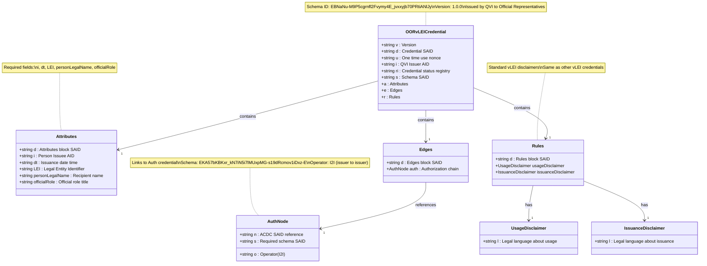

# Legal Entity Official Organizational Role vLEI Credential Schema

```mermaid
classDiagram
    class OORvLEICredential {
        +string v : Version
        +string d : Credential SAID
        +string u : One time use nonce
        +string i : QVI Issuer AID
        +string ri : Credential status registry
        +string s : Schema SAID
        +a : Attributes
        +e : Edges
        +r : Rules
    }

    class Attributes {
        +string d : Attributes block SAID
        +string i : Person Issuee AID
        +string dt : Issuance date time
        +string LEI : Legal Entity Identifier
        +string personLegalName : Recipient name
        +string officialRole : Official role title
    }

    class Edges {
        +string d : Edges block SAID
        +AuthNode auth : Authorization chain
    }

    class AuthNode {
        +string n : ACDC SAID reference
        +string s : Required schema SAID
        +string o : Operator (I2I)
    }

    class Rules {
        +string d : Rules block SAID
        +UsageDisclaimer usageDisclaimer
        +IssuanceDisclaimer issuanceDisclaimer
    }

    class UsageDisclaimer {
        +string l : Legal language about usage
    }

    class IssuanceDisclaimer {
        +string l : Legal language about issuance
    }

    OORvLEICredential --> "1" Attributes : contains
    OORvLEICredential --> "1" Edges : contains
    OORvLEICredential --> "1" Rules : contains
    Edges --> "1" AuthNode : references
    Rules --> "1" UsageDisclaimer : has
    Rules --> "1" IssuanceDisclaimer : has

    note for OORvLEICredential "Schema ID: EBNaNu-M9P5cgrnfl2Fvymy4E_jvxxyjb70PRtiANlJy\nVersion: 1.0.0\nIssued by QVI to Official Representatives"
    
    note for Attributes "Required fields:\ni, dt, LEI, personLegalName, officialRole"
    
    note for AuthNode "Links to Auth credential\nSchema: EKA57bKBKxr_kN7iN5i7lMUxpMG-s19dRcmov1iDxz-E\nOperator: I2I (issuer to issuer)"
    
    note for Rules "Standard vLEI disclaimers\nSame as other vLEI credentials"
```