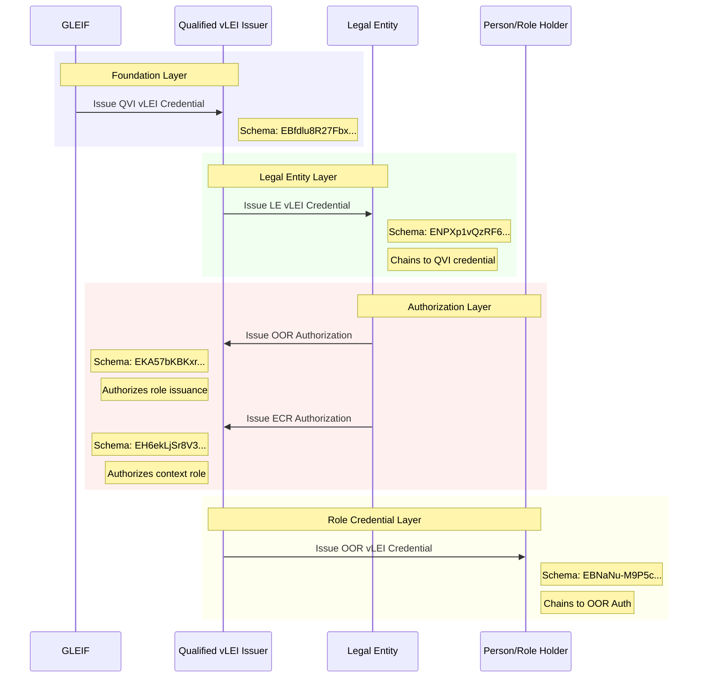

# vLEI Credential Ecosystem - Dependencies and Schema Relationships

```mermaid
graph TB
    %% Core Credential Classes
    class QVICredential {
        +string v : Version
        +string d : Credential SAID
        +string u : One time use nonce
        +string i : GLEIF Issuee AID
        +string ri : Credential status registry
        +string s : Schema SAID
        +Attributes a
        +Rules r
    }

    class LECredential {
        +string v : Version
        +string d : Credential SAID
        +string u : One time use nonce
        +string i : QVI Issuer AID
        +string ri : Credential status registry
        +string s : Schema SAID
        +Attributes a
        +Edges e
        +Rules r
    }

    class OORCredential {
        +string v : Version
        +string d : Credential SAID
        +string u : One time use nonce
        +string i : QVI Issuer AID
        +string ri : Credential status registry
        +string s : Schema SAID
        +Attributes a
        +Edges e
        +Rules r
    }

    class OORAuthCredential {
        +string v : Version
        +string d : Credential SAID
        +string u : One time use nonce
        +string i : LE Issuer AID
        +string ri : Credential status registry
        +string s : Schema SAID
        +Attributes a
        +Edges e
        +Rules r
    }

    class ECRAuthCredential {
        +string v : Version
        +string d : Credential SAID
        +string u : One time use nonce
        +string i : LE Issuer AID
        +string ri : Credential status registry
        +string s : Schema SAID
        +Attributes a
        +Edges e
        +Rules r
    }

    %% Attribute Classes
    class QVIAttributes {
        +string i : QVI Issuee AID
        +string dt : Issuance date time
        +string LEI : Legal Entity Identifier
        +int gracePeriod : Default 90
    }

    class LEAttributes {
        +string i : LE Issuer AID
        +string dt : Issuance date time
        +string LEI : Legal Entity Identifier
    }

    class OORAttributes {
        +string i : Person Issuee AID
        +string dt : Issuance date time
        +string LEI : Legal Entity Identifier
        +string personLegalName : Recipient name
        +string officialRole : Official role title
    }

    class AuthAttributes {
        +string i : QVI Issuee AID
        +string dt : Issuance date time
        +string AID : Recipient AID
        +string LEI : Legal Entity Identifier
        +string personLegalName : Recipient name
        +string role : Role description
    }

    %% Edge Classes
    class QVIEdge {
        +string n : Issuer credential SAID
        +string s : Schema SAID (QVI)
    }

    class LEEdge {
        +string n : Issuer credential SAID
        +string s : Schema SAID (LE)
    }

    class AuthEdge {
        +string n : ACDC SAID reference
        +string s : Schema SAID (Auth)
        +string o : Operator I2I
    }

    %% Rules Classes
    class Rules {
        +UsageDisclaimer usage
        +IssuanceDisclaimer issuance
        +PrivacyDisclaimer privacy
    }

    %% Relationships
    QVICredential --> QVIAttributes : contains
    QVICredential --> Rules : has
    
    LECredential --> LEAttributes : contains
    LECredential --> QVIEdge : chains to
    LECredential --> Rules : has
    
    OORCredential --> OORAttributes : contains
    OORCredential --> AuthEdge : authorized by
    OORCredential --> Rules : has
    
    OORAuthCredential --> AuthAttributes : contains
    OORAuthCredential --> LEEdge : chains to
    OORAuthCredential --> Rules : has
    
    ECRAuthCredential --> AuthAttributes : contains
    ECRAuthCredential --> LEEdge : chains to
    ECRAuthCredential --> Rules : has

    %% Credential Chain Relationships
    LECredential -.->|requires| QVICredential : "QVI must exist"
    OORCredential -.->|requires| OORAuthCredential : "needs authorization"
    OORAuthCredential -.->|requires| LECredential : "LE must exist"
    ECRAuthCredential -.->|requires| LECredential : "LE must exist"

    %% Schema SAIDs
    note for QVICredential "QVI vLEI Credential\nSchema: EBfdlu8R27Fbx-ehrqwImnK-8Cm79sqbAQ4MmvEAYqao\nIssued by: GLEIF → QVI"
    
    note for LECredential "Legal Entity vLEI Credential\nSchema: ENPXp1vQzRF6JwIuS-mp2U8Uf1MoADoP_GqQ62VsDZWY\nIssued by: QVI → LE"
    
    note for OORCredential "Official Organizational Role\nSchema: EBNaNu-M9P5cgrnfl2Fvymy4E_jvxxyjb70PRtiANlJy\nIssued by: QVI → Person"
    
    note for OORAuthCredential "OOR Authorization\nSchema: EKA57bKBKxr_kN7iN5i7lMUxpMG-s19dRcmov1iDxz-E\nIssued by: LE → QVI"
    
    note for ECRAuthCredential "ECR Authorization\nSchema: EH6ekLjSr8V32WyFbGe1zXjTzFs9PkTYmupJ9H65O14g\nIssued by: LE → QVI"
```

## Credential Issuance Flow



## Key Design Patterns

### 1. Credential Chaining
- Each credential (except QVI) references its parent through edges
- Ensures verifiable chain of authority from GLEIF down to individual roles

### 2. SAID References
- Attributes and Rules can be either:
  - Full objects with all properties
  - SAID string references for efficiency

### 3. Common Rules Structure
- All credentials share similar disclaimer structure
- ECR Authorization adds privacy disclaimer for IPEX/ACDC

### 4. Authorization Pattern
- Legal Entities authorize QVIs to issue role credentials
- Separates OOR (official roles) from ECR (engagement context roles)