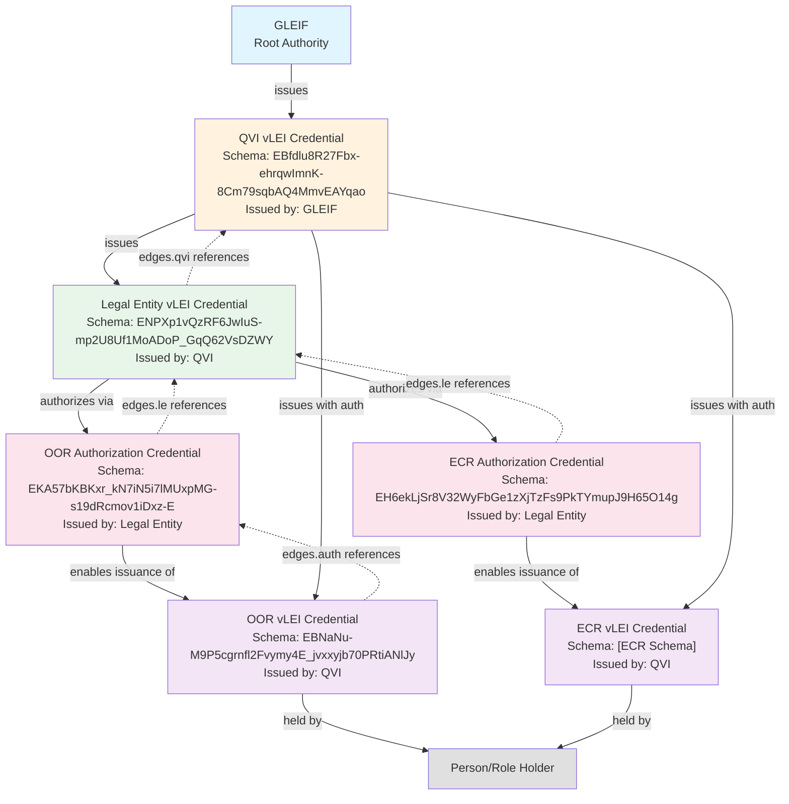
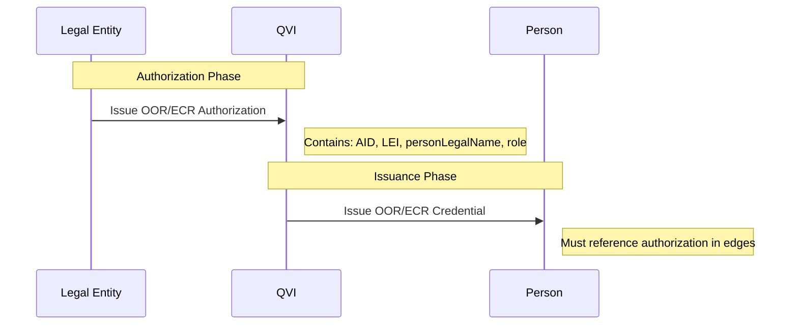

# vLEI Credential Dependencies and Relationships

## Dependency Graph



## Credential Dependencies Table

| Credential Type | Schema SAID | Issuer | Required Dependencies | Edge References |
|----------------|-------------|---------|----------------------|-----------------|
| **QVI vLEI** | `EBfdlu8R27Fbx-ehrqwImnK-8Cm79sqbAQ4MmvEAYqao` | GLEIF | None (Root) | None |
| **Legal Entity vLEI** | `ENPXp1vQzRF6JwIuS-mp2U8Uf1MoADoP_GqQ62VsDZWY` | QVI | QVI Credential | edges.qvi → QVI Schema |
| **OOR Authorization** | `EKA57bKBKxr_kN7iN5i7lMUxpMG-s19dRcmov1iDxz-E` | Legal Entity | LE Credential | edges.le → LE Schema |
| **ECR Authorization** | `EH6ekLjSr8V32WyFbGe1zXjTzFs9PkTYmupJ9H65O14g` | Legal Entity | LE Credential | edges.le → LE Schema |
| **OOR vLEI** | `EBNaNu-M9P5cgrnfl2Fvymy4E_jvxxyjb70PRtiANlJy` | QVI | OOR Authorization | edges.auth → OOR Auth Schema |
| **ECR vLEI** | `EEy9PkikFcANV1l7EHukCeXqrzT1hNZjGlUk7wuMO5jw` | QVI | ECR Authorization | edges.auth → ECR Auth Schema |

## Dependency Rules

### 1. **Hierarchical Dependencies**
- GLEIF is the root authority (no dependencies)
- QVIs must have valid GLEIF-issued credentials
- Legal Entities must have valid QVI-issued credentials
- Role credentials require authorization from Legal Entities

### 2. **Edge-Based Verification**
Each credential (except QVI) contains an `edges` block that references parent credentials:

```json
"edges": {
  "parentType": {
    "n": "Parent credential SAID",
    "s": "Parent schema SAID (constant)"
  }
}
```

### 3. **Authorization Flow**


### 4. **Validation Chain**
To validate any credential, verifiers must:
1. Check the credential signature and status
2. Follow edge references up the chain
3. Validate each parent credential
4. Ensure unbroken chain to GLEIF root

## Critical Dependencies

### For QVI Operations
- **Required**: Valid QVI vLEI Credential from GLEIF
- **Enables**: Issuing LE credentials, OOR/ECR credentials (with auth)

### For Legal Entity Operations  
- **Required**: Valid LE vLEI Credential from QVI
- **Enables**: Issuing OOR/ECR Authorization credentials

### For Role Issuance
- **Required**: Valid Authorization credential from LE + Valid QVI credential
- **Enables**: Issuing role credentials to persons