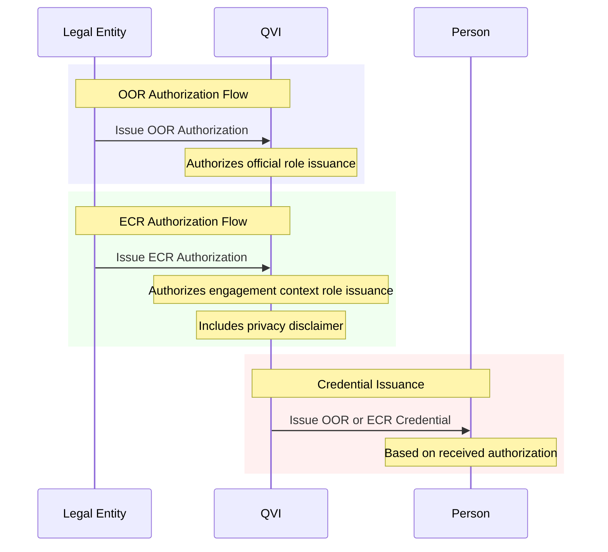

# Authorization vLEI Credential Schemas

The vLEI ecosystem uses authorization credentials issued by Legal Entities to QVIs to authorize the issuance of role credentials to individuals. There are two types of authorization credentials:

## Authorization Credential Types

### [OOR Authorization Credential](/oor-auth-credential-schema/)
- **Purpose**: Authorize issuance of Official Organizational Role (OOR) credentials
- **Schema SAID**: `EKA57bKBKxr_kN7iN5i7lMUxpMG-s19dRcmov1iDxz-E`
- **Use Case**: Permanent organizational roles (CEO, CFO, Director, etc.)

### [ECR Authorization Credential](/ecr-auth-credential-schema/)
- **Purpose**: Authorize issuance of Engagement Context Role (ECR) credentials
- **Schema SAID**: `EH6ekLjSr8V32WyFbGe1zXjTzFs9PkTYmupJ9H65O14g`
- **Use Case**: Context-specific engagements (Project Lead, Consultant, etc.)

## Authorization Credential Comparison

| Feature | OOR Authorization | ECR Authorization |
|---------|------------------|-------------------|
| **Schema SAID** | `EKA57bKBKxr_kN7iN5i7lMUxpMG-s19dRcmov1iDxz-E` | `EH6ekLjSr8V32WyFbGe1zXjTzFs9PkTYmupJ9H65O14g` |
| **Issuer** | Legal Entity | Legal Entity |
| **Recipient** | QVI | QVI |
| **Purpose** | Authorize OOR credential issuance | Authorize ECR credential issuance |
| **Role Field** | `officialRole` | `engagementContextRole` |
| **Privacy Disclaimer** | No | Yes |
| **Use Case** | Permanent organizational roles | Context-specific engagements |

## Authorization Flow Overview

## Key Architectural Points

1. **Both authorization types**:
   - Are issued by Legal Entities to QVIs
   - Reference the LE credential in their edges
   - Use the I2I (issuer-to-issuer) operator
   - Share similar structure but different purposes

2. **Authorization enables credential issuance**:
   - QVIs must hold valid authorization to issue role credentials
   - Authorization specifies the person and role being authorized
   - The issued credential chains back to the authorization

## Related Documentation

- [OOR Auth Credential Schema](/oor-auth-credential-schema/) - Detailed OOR authorization structure
- [ECR Auth Credential Schema](/ecr-auth-credential-schema/) - Detailed ECR authorization structure
- [OOR Credential Schema](/oor-credential-schema/) - OOR role credentials issued to persons
- [ECR Credential Schema](/ecr-credential-schema/) - ECR role credentials issued to persons