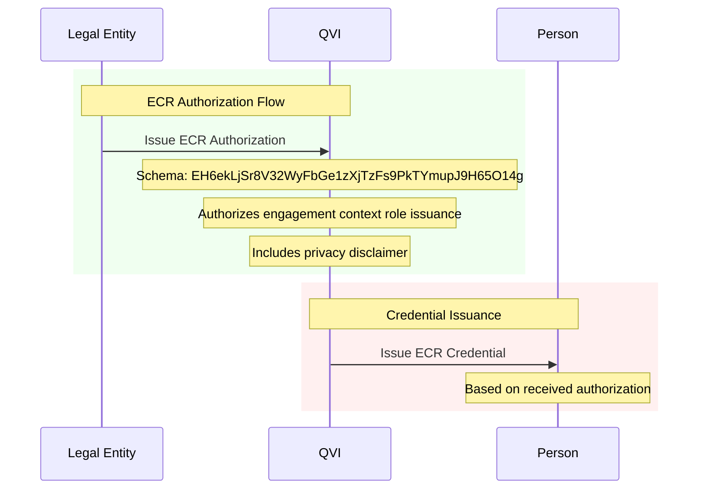
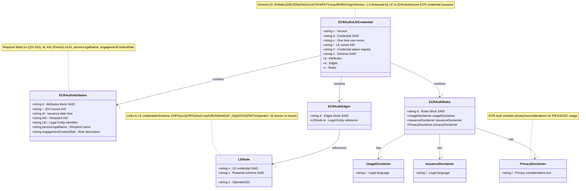

# ECR Authorization vLEI Credential Schema

## Schema Details

The ECR Authorization credential is issued by Legal Entities to QVIs, authorizing them to issue ECR credentials for specific engagement context roles within the organization.

- **Schema SAID**: `EH6ekLjSr8V32WyFbGe1zXjTzFs9PkTYmupJ9H65O14g`
- **Version**: 1.0.0
- **Issuer**: Legal Entity
- **Holder**: Qualified vLEI Issuer (QVI)
- **Purpose**: Authorize ECR credential issuance for engagement context roles

## Key Characteristics

- **Engagement-Specific**: For temporary, project-based, or consultancy roles
- **Person Specification**: Includes AID and legal name of intended recipient
- **Role Description**: Specifies the engagement context role
- **Privacy Considerations**: Includes privacy disclaimer for IPEX/ACDC usage
- **Edge Chaining**: Links to Legal Entity's vLEI credential

## Authorization Flow

### Issuance Process

## Rules and Disclaimers

The ECR Authorization credential includes three disclaimer types:

- **Usage Disclaimer**: Legal language about credential usage rights and limitations
- **Issuance Disclaimer**: Terms and conditions for credential issuance
- **Privacy Disclaimer**: Privacy considerations for IPEX/ACDC usage (unique to ECR Auth)

The privacy disclaimer is specific to ECR Authorization credentials, acknowledging that engagement context roles may involve external parties requiring additional privacy protections.

