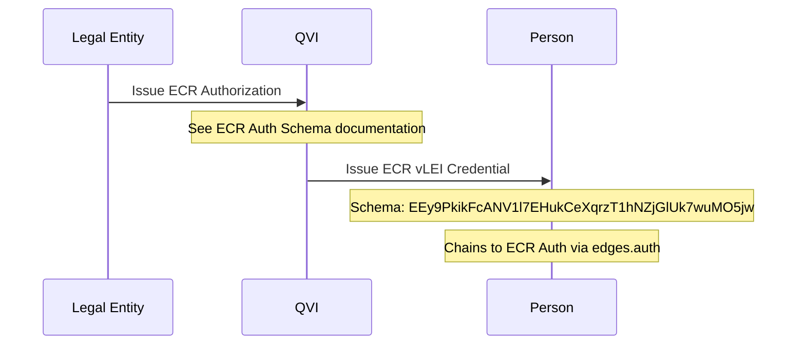
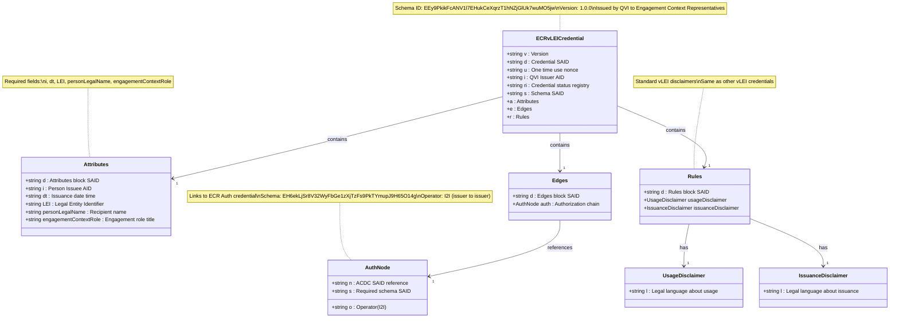

# Engagement Context Role (ECR) vLEI Credential Schema

## Schema Details

The ECR vLEI credential represents engagement context roles for individuals operating in specific project or consultancy contexts within or on behalf of a legal entity.

- **Schema SAID**: `EEy9PkikFcANV1l7EHukCeXqrzT1hNZjGlUk7wuMO5jw`
- **Version**: 1.0.0
- **Issuer**: Qualified vLEI Issuer (QVI)
- **Holder**: Individual with engagement context role
- **Authorization Required**: ECR Auth credential from Legal Entity

## Key Characteristics

- **Context-Specific**: For temporary or project-based engagements
- **Flexible Roles**: Uses `engagementContextRole` field for role description
- **Authorization Chain**: Requires ECR Auth from Legal Entity to QVI
- **LEI Binding**: Tied to organization's Legal Entity Identifier
- **Use Cases**: Consultancy, contractor roles, project teams, external engagements

## Authorization Reference

The ECR vLEI Credential requires an ECR Authorization credential from the Legal Entity. This authorization allows the QVI to issue ECR credentials for specific engagement contexts.

- **Auth Schema SAID**: `EH6ekLjSr8V32WyFbGe1zXjTzFs9PkTYmupJ9H65O14g`
- **Auth Type**: Issuer-to-Issuer (I2I)
- See [ECR Auth Credential Schema](ecr-auth-credential-schema) for details

## Issuance Process

