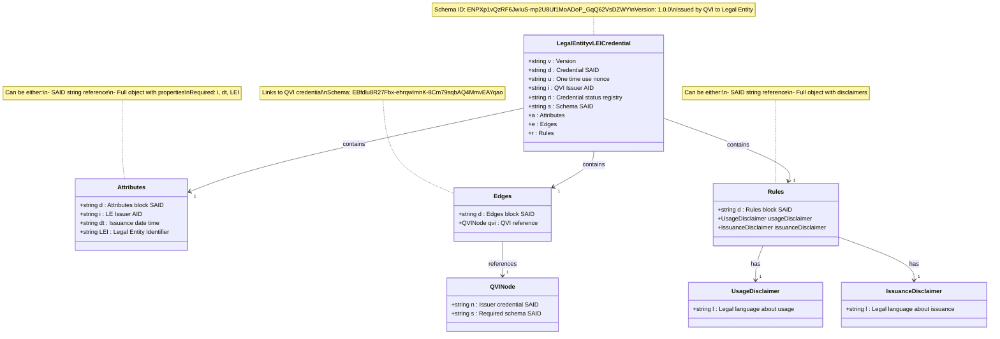

# Legal Entity vLEI Credential Schema

## Schema Details

The Legal Entity vLEI credential is issued by QVIs to organizations with valid Legal Entity Identifiers. This credential serves as the foundation for role-based credentials within an organization.

- **Schema SAID**: `ENPXp1vQzRF6JwIuS-mp2U8Uf1MoADoP_GqQ62VsDZWY`
- **Version**: 1.0.0
- **Issuer**: Qualified vLEI Issuer (QVI)
- **Holder**: Legal Entity (organization with LEI)

## Key Characteristics

- **LEI Verification**: Requires valid and active Legal Entity Identifier
- **QVI Chain**: Must be chained to issuer's QVI credential from GLEIF
- **Status Registry**: Transaction Event Log maintains issuance status
- **Edge References**: Cryptographically links to parent QVI credential
- **Foundation Credential**: Enables issuance of OOR and ECR Auth credentials

