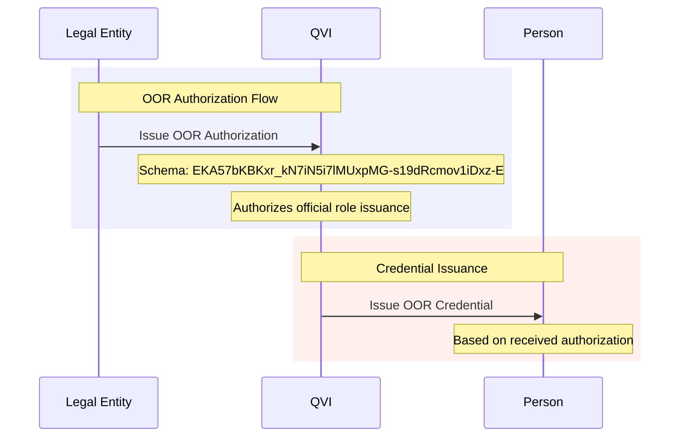
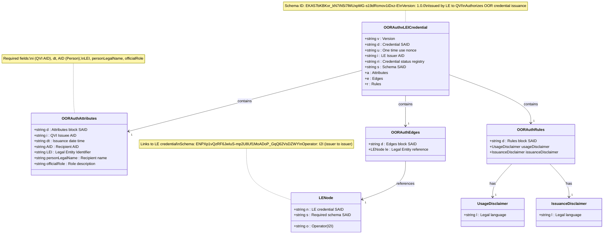

# OOR Authorization vLEI Credential Schema

## Schema Details

The OOR Authorization credential is issued by Legal Entities to QVIs, authorizing them to issue OOR credentials for official organizational roles within the organization.

- **Schema SAID**: `EKA57bKBKxr_kN7iN5i7lMUxpMG-s19dRcmov1iDxz-E`
- **Version**: 1.0.0
- **Issuer**: Legal Entity
- **Holder**: Qualified vLEI Issuer (QVI)
- **Purpose**: Authorize OOR credential issuance for official organizational roles

## Key Characteristics

- **Official Positions**: For permanent, formal organizational roles (CEO, CFO, Director, Manager)
- **Person Specification**: Includes AID and legal name of intended recipient
- **Role Description**: Specifies the official organizational role
- **Formal Hierarchy**: Represents official organizational structure
- **Edge Chaining**: Links to Legal Entity's vLEI credential

## Authorization Flow

### Issuance Process

## Rules and Disclaimers

The OOR Authorization credential includes two disclaimer types:

- **Usage Disclaimer**: Legal language about credential usage rights and limitations
- **Issuance Disclaimer**: Terms and conditions for credential issuance

Note: Unlike ECR Authorization, OOR Authorization does not include a privacy disclaimer as it is intended for official organizational roles that are typically public.

