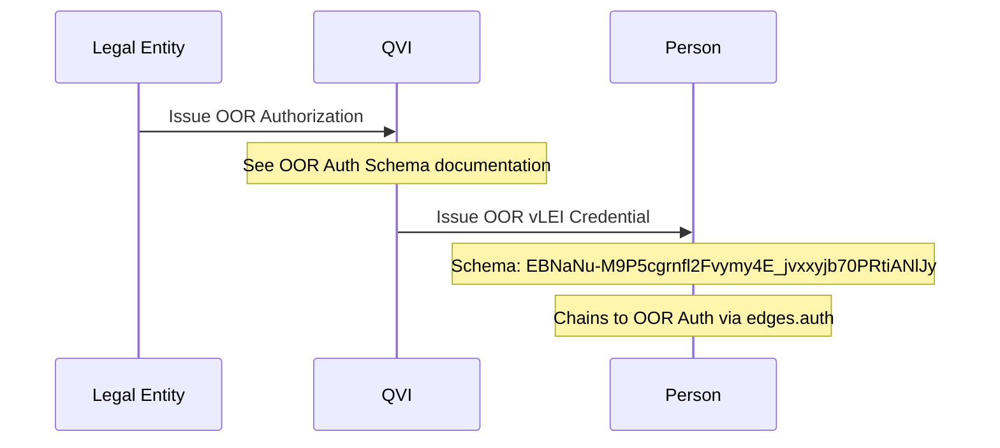
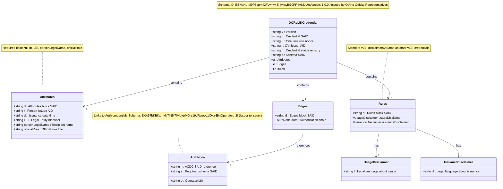

# Legal Entity Official Organizational Role (OOR) vLEI Credential Schema

## Schema Details

The OOR vLEI credential represents official organizational roles within a legal entity. These credentials are issued by QVIs to individuals holding formal positions in an organization.

- **Schema SAID**: `EBNaNu-M9P5cgrnfl2Fvymy4E_jvxxyjb70PRtiANlJy`
- **Version**: 1.0.0
- **Issuer**: Qualified vLEI Issuer (QVI)
- **Holder**: Individual with official organizational role
- **Authorization Required**: OOR Auth credential from Legal Entity

## Key Characteristics

- **Official Positions**: For formal organizational roles (CEO, CFO, Director, etc.)
- **LEI Binding**: Tied to organization's Legal Entity Identifier
- **Authorization Chain**: Requires OOR Auth from Legal Entity to QVI
- **Person Identification**: Links to individual's Autonomic Identifier (AID)
- **Role Specificity**: Uses `officialRole` field for position title

## Authorization Reference

The OOR vLEI Credential requires an OOR Authorization credential from the Legal Entity. This authorization allows the QVI to issue OOR credentials on behalf of the organization.

- **Auth Schema SAID**: `EKA57bKBKxr_kN7iN5i7lMUxpMG-s19dRcmov1iDxz-E`
- **Auth Type**: Issuer-to-Issuer (I2I) delegation
- See [OOR Auth Credential Schema](oor-auth-credential-schema) for details

## Issuance Process

