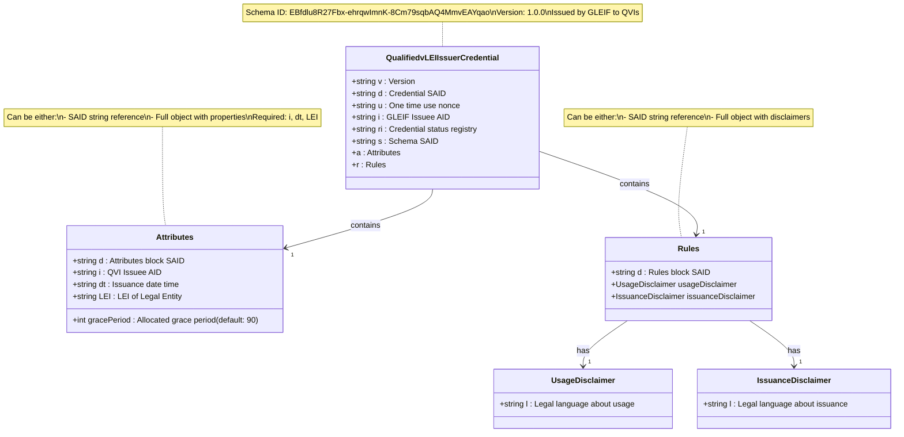

# Qualified vLEI Issuer (QVI) Credential Schema

## Schema Details

The QVI credential is the foundational credential in the vLEI ecosystem, issued directly by GLEIF to Qualified vLEI Issuers. This credential authorizes QVIs to issue Legal Entity vLEI credentials to organizations.

- **Schema SAID**: `EBfdlu8R27Fbx-ehrqwImnK-8Cm79sqbAQ4MmvEAYqao`
- **Version**: 1.0.0
- **Issuer**: GLEIF (Global Legal Entity Identifier Foundation)
- **Holder**: Qualified vLEI Issuer (QVI)

## Key Characteristics

- **Direct GLEIF Issuance**: Only GLEIF can issue QVI credentials
- **Delegation**: GLEIF MUST delegate the QVI AID
- **LEI Requirement**: QVI must have a valid Legal Entity Identifier
- **Status Registry**: Transaction Event Log maintains issuance status

