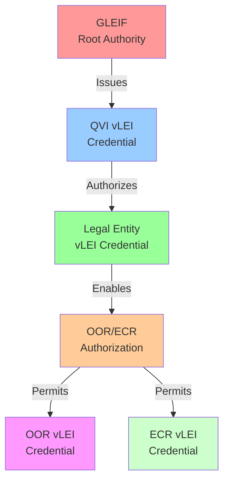
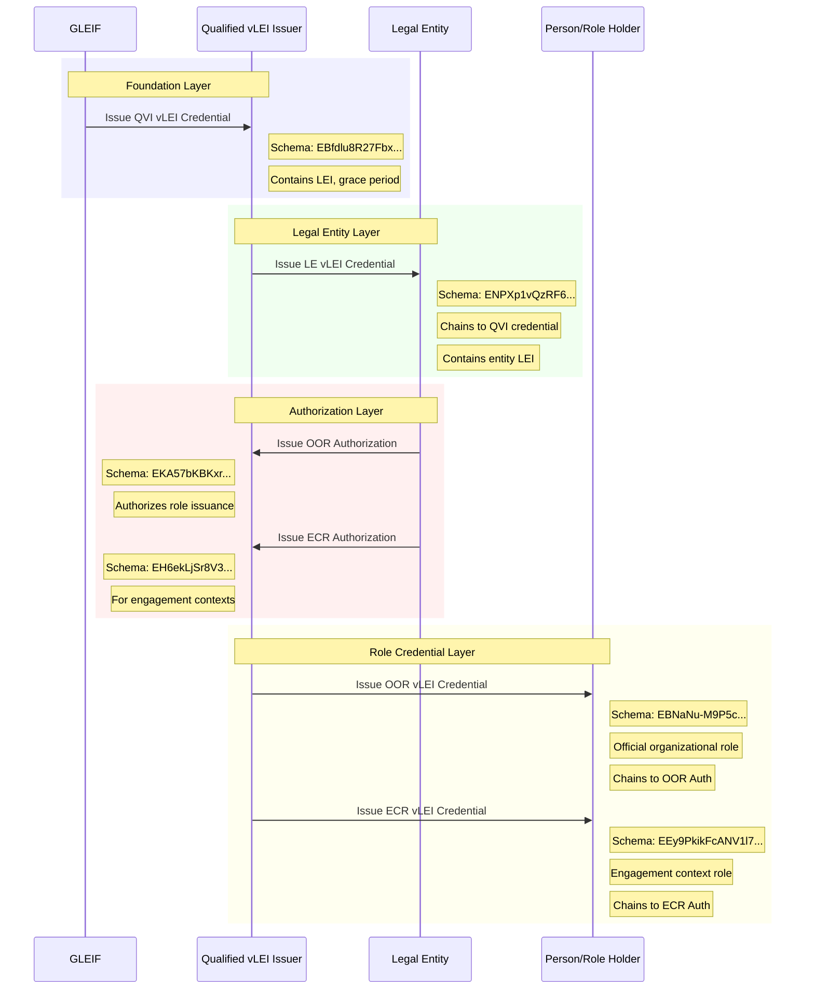

# vLEI Credential Ecosystem Overview

This document provides a comprehensive overview of the verifiable Legal Entity Identifier (vLEI) credential ecosystem implemented using KERI (Key Event Receipt Infrastructure) and ACDC (Authentic Chained Data Containers).

## Credential Types

The vLEI ecosystem consists of six primary credential types that form a hierarchical trust chain:

### 1. QVI vLEI Credential

- **Schema SAID**: `EBfdlu8R27Fbx-ehrqwImnK-8Cm79sqbAQ4MmvEAYqao`
- **Issuer**: GLEIF (Global Legal Entity Identifier Foundation)
- **Recipient**: Qualified vLEI Issuers (QVIs)
- **Purpose**: Authorizes QVIs to issue Legal Entity vLEI credentials
- **Key Data**: LEI of the QVI organization, grace period (default 90 days)

### 2. Legal Entity vLEI Credential

- **Schema SAID**: `ENPXp1vQzRF6JwIuS-mp2U8Uf1MoADoP_GqQ62VsDZWY`
- **Issuer**: Qualified vLEI Issuer (QVI)
- **Recipient**: Legal Entity (LE)
- **Purpose**: Establishes the verified legal identity of an organization
- **Key Data**: LEI of the legal entity, chains to QVI credential

### 3. OOR Authorization vLEI Credential

- **Schema SAID**: `EKA57bKBKxr_kN7iN5i7lMUxpMG-s19dRcmov1iDxz-E`
- **Issuer**: Legal Entity (LE)
- **Recipient**: Qualified vLEI Issuer (QVI)
- **Purpose**: Authorizes QVI to issue Official Organizational Role credentials
- **Key Data**: Person's AID, role details, chains to LE credential

### 4. Official Organizational Role (OOR) vLEI Credential

- **Schema SAID**: `EBNaNu-M9P5cgrnfl2Fvymy4E_jvxxyjb70PRtiANlJy`
- **Issuer**: Qualified vLEI Issuer (QVI)
- **Recipient**: Person/Role Holder
- **Purpose**: Verifies a person's official role within an organization
- **Key Data**: Person's legal name, official role title, LEI reference

### 5. ECR vLEI Credential

- **Schema SAID**: `EEy9PkikFcANV1l7EHukCeXqrzT1hNZjGlUk7wuMO5jw`
- **Issuer**: Qualified vLEI Issuer (QVI)
- **Recipient**: Person/Role Holder
- **Purpose**: Verifies a person's engagement context role for specific interactions
- **Key Data**: Person's legal name, engagement role title, LEI reference, chains to ECR Auth

### 6. ECR Authorization vLEI Credential

- **Schema SAID**: `EH6ekLjSr8V32WyFbGe1zXjTzFs9PkTYmupJ9H65O14g`
- **Issuer**: Legal Entity (LE)
- **Recipient**: Qualified vLEI Issuer (QVI)
- **Purpose**: Authorizes QVI to issue Engagement Context Role credentials
- **Key Data**: Similar to OOR Auth but for engagement-specific roles
- **Special Feature**: Includes privacy disclaimer for IPEX/ACDC usage

## Trust Chain Flow

## Credential Issuance Sequence

## Key Architecture Features

### Credential Chaining

- Each credential (except QVI) contains edges that reference its authorizing parent credential
- Creates a verifiable chain of authority from GLEIF down to individual roles
- Enables cryptographic verification of the entire trust chain

### SAID-Based References

- All credential components use Self-Addressing Identifiers (SAIDs)
- Attributes and Rules can be either full objects or SAID string references
- Enables efficient storage and transmission while maintaining integrity

### Common Structure

All vLEI credentials share a common ACDC structure:

- **v**: Version string
- **d**: Credential SAID
- **u**: One-time use nonce (privacy-preserving metadata)
- **i**: Issuer AID
- **ri**: Credential status registry
- **s**: Schema SAID
- **a**: Attributes (content-specific)
- **e**: Edges (chaining relationships)
- **r**: Rules (usage and issuance disclaimers)

### Authorization Pattern

- Legal Entities issue authorization credentials to QVIs
- QVIs then issue role credentials to individuals
- Separates official roles (OOR) from engagement context roles (ECR)
- ECR includes additional privacy considerations for IPEX/ACDC usage

## Verification Process

To verify any credential in the ecosystem:

1. **Validate the credential structure** against its schema SAID
2. **Verify the issuer signature** using KERI
3. **Check the credential status** in the revocation registry
4. **Follow the edge references** to validate the chain of authority
5. **Verify each parent credential** recursively up to GLEIF

## Use Cases

- **Supply Chain Verification**: Verify the legal identity of trading partners
- **Digital Identity**: Establish organizational roles for digital interactions  
- **Regulatory Compliance**: Provide cryptographic proof of organizational authority
- **Selective Disclosure**: Share only necessary identity attributes
- **Cross-Border Commerce**: Enable trusted international business relationships
