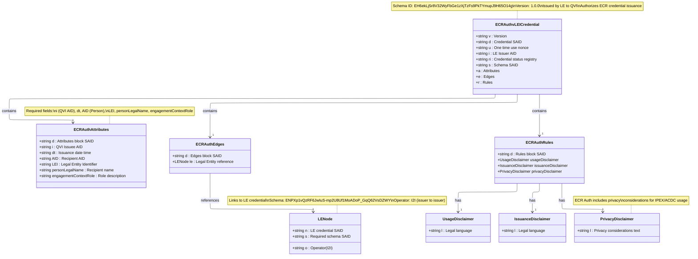
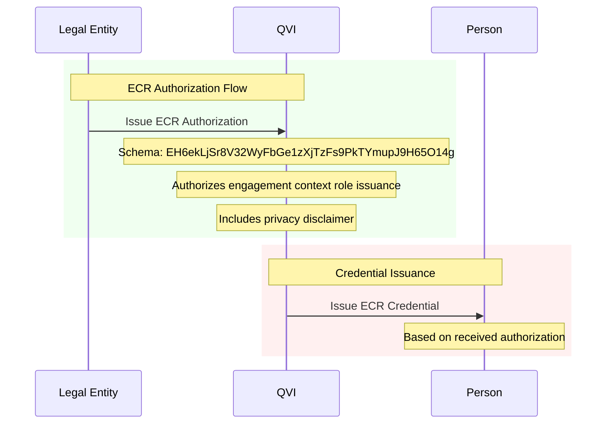

# ECR Authorization vLEI Credential Schema

## ECR Authorization vLEI Credential Structure

## Schema Details

- **Schema SAID**: `EH6ekLjSr8V32WyFbGe1zXjTzFs9PkTYmupJ9H65O14g`
- **Version**: 1.0.0
- **Issuer**: Legal Entity
- **Recipient**: QVI (Qualified vLEI Issuer)
- **Purpose**: Authorize ECR credential issuance for engagement context roles

## Key Characteristics

1. **For engagement-specific or temporary roles**
   - Examples: Project Lead, Consultant, Temporary Representative
   - Context-specific engagements

2. **Required Attributes**:
   - `i`: QVI Issuee AID
   - `dt`: Issuance date time
   - `AID`: Recipient Person AID
   - `LEI`: Legal Entity Identifier
   - `personLegalName`: Recipient name
   - `engagementContextRole`: Engagement context role description

3. **Edge References**:
   - Links to Legal Entity credential
   - Uses I2I (issuer-to-issuer) operator
   - LE Schema: `ENPXp1vQzRF6JwIuS-mp2U8Uf1MoADoP_GqQ62VsDZWY`

## Authorization Flow

## Rules and Disclaimers

The ECR Authorization credential includes:
- **Usage Disclaimer**: Legal language about credential usage
- **Issuance Disclaimer**: Legal language about issuance terms
- **Privacy Disclaimer**: Privacy considerations for IPEX/ACDC usage

The privacy disclaimer is unique to ECR Authorization, recognizing that engagement context roles may require additional privacy considerations for context-specific interactions.

## Differences from OOR Authorization

| Feature | ECR Authorization | OOR Authorization |
|---------|------------------|-------------------|
| **Schema SAID** | `EH6ekLjSr8V32WyFbGe1zXjTzFs9PkTYmupJ9H65O14g` | `EKA57bKBKxr_kN7iN5i7lMUxpMG-s19dRcmov1iDxz-E` |
| **Role Field** | `engagementContextRole` | `officialRole` |
| **Privacy Disclaimer** | Yes | No |
| **Use Case** | Context-specific engagements | Permanent organizational roles |