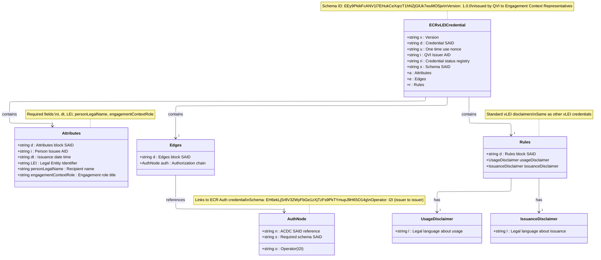
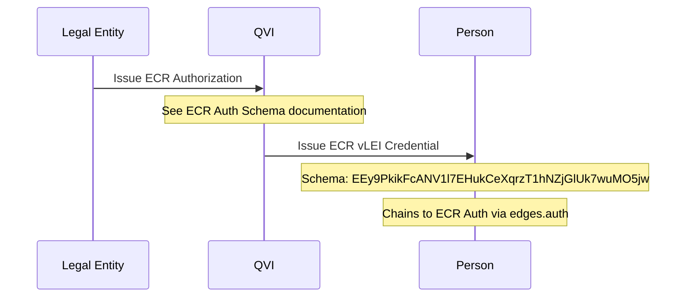

# Engagement Context Role (ECR) vLEI Credential Schema

## ECR vLEI Credential Structure

## Authorization Reference

The ECR vLEI Credential requires an ECR Authorization credential from the Legal Entity. For details on the ECR Authorization structure, see [ECR Auth Credential Schema](/ecr-auth-credential-schema/).

## Key Characteristics

1. **Purpose**: ECR credentials are for specific engagement contexts rather than official organizational positions
2. **Field Names**: Uses `engagementContextRole` for the role description
3. **Use Cases**: Temporary or context-specific interactions, project-based roles, consultancy engagements

## Schema Details

### ECR vLEI Credential
- **Schema SAID**: `EEy9PkikFcANV1l7EHukCeXqrzT1hNZjGlUk7wuMO5jw`
- **Version**: 1.0.0
- **Issuer**: QVI (Qualified vLEI Issuer)
- **Recipient**: Person with engagement context role
- **Authorization Required**: ECR Auth credential from LE

### Authorization Requirements
- The QVI must hold a valid ECR Authorization credential from the Legal Entity
- Authorization Schema SAID: `EH6ekLjSr8V32WyFbGe1zXjTzFs9PkTYmupJ9H65O14g`
- See [ECR Auth Credential Schema](/ecr-auth-credential-schema/) for full authorization details

## Credential Flow

