# vLEI Ecosystem Credential Documentation

This documentation covers the implementation of the GLEIF vLEI ecosystem using KERI (Key Event Receipt Infrastructure) and ACDC (Authentic Chained Data Containers).

### Overview

- [Credentials types](credentials) - Introduction to the credential types and their relationships
- [vLEI Credential Ecosystem](vlei-credential-ecosystem) - Detailed ecosystem architecture and workflows
- [Dependency Graph](vlei-dependency-graph) - Visual representation of credential dependencies

### Credential Schemas

- [Legal Entity Credential](/legal-entity-credential-schema) - LE credential schema details
- [QVI Credential](/qvi-credential-schema/) - Qualified vLEI Issuer credential schema
- [OOR Auth Credential](/oor-auth-credential-schema/) - Official Organizational Role Authorization credential schema
- [OOR Credential](/oor-credential-schema/) - Official Organizational Role credential schema
- [ECR Auth Credential](/ecr-auth-credential-schema/) - Engagement Context Role Authorization credential schema
- [ECR Credential](/ecr-credential-schema/) - Engagement Context Role credential schema

## Quick Start

The vLEI ecosystem implements a hierarchical trust model for organizational identity verification:

1. **Root of Trust**: GLEIF as the global authority
2. **QVIs**: Qualified vLEI Issuers authorized by GLEIF
3. **Legal Entities**: Organizations with vLEI credentials
4. **Role Holders**: Individuals with official organizational roles

## Key Features

- **Cryptographic Verification**: All credentials are cryptographically end verifiable using KERI
- **Chain of Authority**: Clear delegation chains from GLEIF to individual role holders
- **Privacy-Preserving**: Selective disclosure and compact credentials
- **Revocation Support**: Transaction Event Logs capture issuance state

## Additional Resources

- [KERI Specification](https://trustoverip.github.io/tswg-keri-specification/)
- [ACDC Specification](https://trustoverip.github.io/tswg-acdc-specification/)
- [CESR Specification](https://trustoverip.github.io/tswg-cesr-specification/)
# vLEI Credential Ecosystem - Dependencies and Schema Relationships

```mermaid
classDiagram
    class QVICredential {
        +string v : Version
        +string d : Credential SAID
        +string u : One time use nonce
        +string i : GLEIF Issuee AID
        +string ri : Credential status registry
        +string s : Schema SAID
        +Attributes a : Attributes block
        +Rules r : Rules block
    }
    class LECredential {
        +string v : Version
        +string d : Credential SAID
        +string u : One time use nonce
        +string i : QVI Issuer AID
        +string ri : Credential status registry
        +string s : Schema SAID
        +Attributes a : Attributes block
        +Edges e : Edges block
        +Rules r : Rules block
    }
    class OORCredential {
        +string v : Version
        +string d : Credential SAID
        +string u : One time use nonce
        +string i : QVI Issuer AID
        +string ri : Credential status registry
        +string s : Schema SAID
        +Attributes a : Attributes block
        +Edges e : Edges block
        +Rules r : Rules block
    }
    class OORAuthCredential {
        +string v : Version
        +string d : Credential SAID
        +string u : One time use nonce
        +string i : LE Issuer AID
        +string ri : Credential status registry
        +string s : Schema SAID
        +Attributes a : Attributes block
        +Edges e : Edges block
        +Rules r : Rules block
    }
    class ECRAuthCredential {
        +string v : Version
        +string d : Credential SAID
        +string u : One time use nonce
        +string i : LE Issuer AID
        +string ri : Credential status registry
        +string s : Schema SAID
        +Attributes a : Attributes block
        +Edges e : Edges block
        +Rules r : Rules block
    }
    class QVIAttributes {
        +string i : QVI Issuee AID
        +string dt : Issuance date time
        +string LEI : LEI of the requesting Legal Entity
        +int gracePeriod : Allocated grace period
    }
    class LEAttributes {
        +string i : LE Issuer AID
        +string dt : issuance date time
        +string LEI : LE Issuer AID
    }
    class OORAttributes {
        +string i : Person Issuee AID
        +string dt : Issuance date time
        +string LEI : LEI of the Legal Entity
        +string personLegalName : Recipient name as provided during identity assurance
        +string officialRole : Official role title
    }
    class AuthAttributes {
        +string i : QVI Issuee AID
        +string dt : Issuance date time
        +string AID : AID of the intended recipient of the ECR credential
        +string LEI : LEI of the requesting Legal Entity
        +string personLegalName : Requested recipient name as provided during identity assurance
        +string role : Requested role description
    }
    class QVIEdge {
        +string n : Issuer credential SAID
        +string s : SAID of required schema of the credential pointed to by this node
    }
    class LEEdge {
        +string n : Issuer credential SAID
        +string s : SAID of required schema of the credential pointed to by this node
    }
    class AuthEdge {
        +string n : Issuer credential SAID
        +string s : SAID of required schema of the credential pointed to by this node
        +string o : Operator for this edge
    }
    class Rules {
        +UsageDisclaimer usageDisclaimer : Usage Disclaimer
        +IssuanceDisclaimer issuanceDisclaimer : Issuance Disclaimer
        +PrivacyDisclaimer privacyDisclaimer : Privacy Disclaimer
    }
    QVICredential --> QVIAttributes : contains
    QVICredential --> Rules : has
    LECredential --> LEAttributes : contains
    LECredential --> QVIEdge : chains to
    LECredential --> Rules : has
    OORCredential --> OORAttributes : contains
    OORCredential --> AuthEdge : authorized by
    OORCredential --> Rules : has
    OORAuthCredential --> AuthAttributes : contains
    OORAuthCredential --> LEEdge : chains to
    OORAuthCredential --> Rules : has
    ECRAuthCredential --> AuthAttributes : contains
    ECRAuthCredential --> LEEdge : chains to
    ECRAuthCredential --> Rules : has
    LECredential ..> QVICredential : requires - QVI must exist
    OORCredential ..> OORAuthCredential : requires - needs authorization
    OORAuthCredential ..> LECredential : requires - LE must exist
    ECRAuthCredential ..> LECredential : requires - LE must exist
    note for QVICredential "QVI vLEI Credential<br/>Schema: EBfdlu8R27Fbx-ehrqwImnK-8Cm79sqbAQ4MmvEAYqao<br/>Issued by: GLEIF → QVI"
    note for LECredential "Legal Entity vLEI Credential<br/>Schema: ENPXp1vQzRF6JwIuS-mp2U8Uf1MoADoP_GqQ62VsDZWY<br/>Issued by: QVI → LE"
    note for OORCredential "Official Organizational Role<br/>Schema: EBNaNu-M9P5cgrnfl2Fvymy4E_jvxxyjb70PRtiANlJy<br/>Issued by: QVI → Person"
    note for OORAuthCredential "OOR Authorization<br/>Schema: EKA57bKBKxr_kN7iN5i7lMUxpMG-s19dRcmov1iDxz-E<br/>Issued by: LE → QVI"
    note for ECRAuthCredential "ECR Authorization<br/>Schema: EH6ekLjSr8V32WyFbGe1zXjTzFs9PkTYmupJ9H65O14g<br/>Issued by: LE → QVI"

```

## Credential Issuance Flow

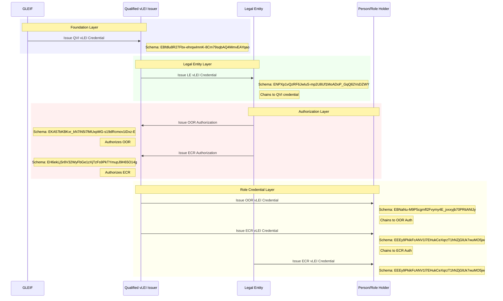

## Key Design Patterns

### 1. Credential Chaining

- Each credential (except QVI) references its chained credentials through edges
- Ensures verifiable chain of authority from GLEIF down to individual roles

### 2. Compact credentials

- Attributes and Rules can be either:
  - Full objects with all properties
  - SAIDs for compactness

### 3. Common Rules Structure

- All credentials share similar disclaimer structure
- ECR Authorization adds privacy disclaimer for IPEX/ACDC

### 4. Authorization Pattern

- Legal Entities authorize QVIs to issue role credentials
- Separates OOR (official roles) from ECR (engagement context roles)

### 5. Legal Entities as issues

- Legal Entities can issue their own ECR credentials without a preceeding ECR Auth
# vLEI Credential Dependencies and Relationships

## Dependency Graph

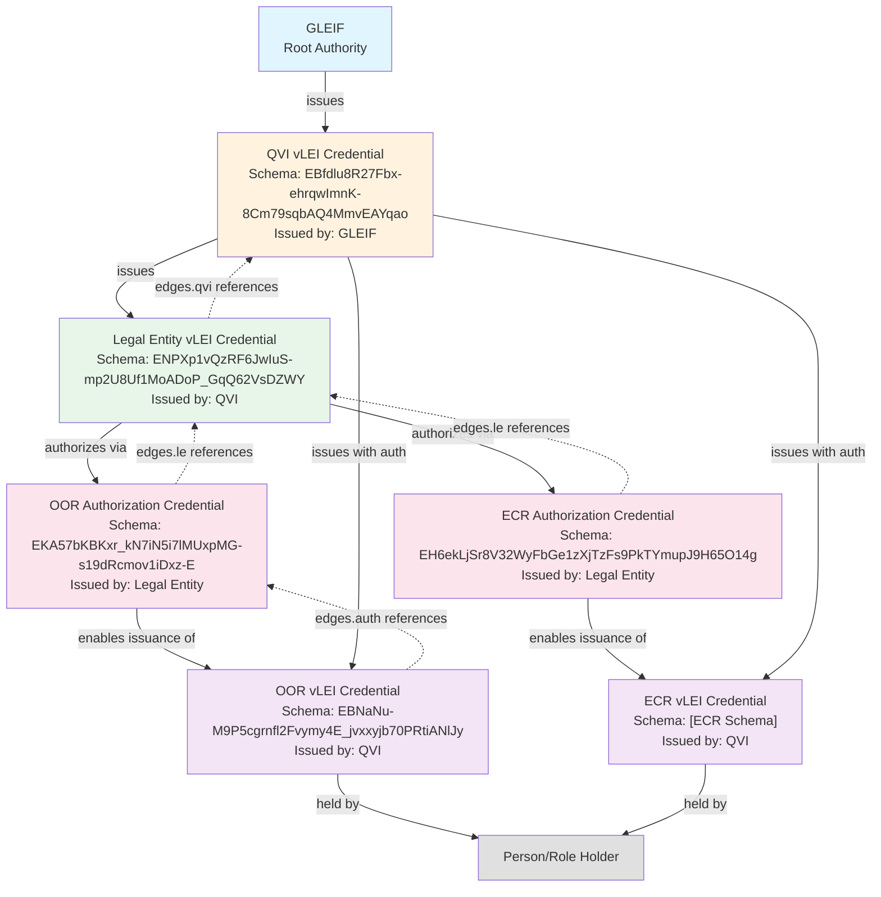

## Credential Dependencies Table

| Credential Type | Schema SAID | Issuer | Required Dependencies | Edge References |
|----------------|-------------|---------|----------------------|-----------------|
| **QVI vLEI** | `EBfdlu8R27Fbx-ehrqwImnK-8Cm79sqbAQ4MmvEAYqao` | GLEIF | None (Root) | None |
| **Legal Entity vLEI** | `ENPXp1vQzRF6JwIuS-mp2U8Uf1MoADoP_GqQ62VsDZWY` | QVI | QVI Credential | edges.qvi → QVI Schema |
| **OOR Authorization** | `EKA57bKBKxr_kN7iN5i7lMUxpMG-s19dRcmov1iDxz-E` | Legal Entity | LE Credential | edges.le → LE Schema |
| **ECR Authorization** | `EH6ekLjSr8V32WyFbGe1zXjTzFs9PkTYmupJ9H65O14g` | Legal Entity | LE Credential | edges.le → LE Schema |
| **OOR vLEI** | `EBNaNu-M9P5cgrnfl2Fvymy4E_jvxxyjb70PRtiANlJy` | QVI | OOR Authorization | edges.auth → OOR Auth Schema |
| **ECR vLEI** | `EEy9PkikFcANV1l7EHukCeXqrzT1hNZjGlUk7wuMO5jw` | QVI | ECR Authorization | edges.auth → ECR Auth Schema |

## Dependency Rules

### 1. **Hierarchical Dependencies**

- GLEIF is the root authority (no dependencies)
- QVIs must have valid GLEIF-issued credentials
- Legal Entities must have valid QVI-issued credentials
- Role credentials require authorization from Legal Entities

### 2. **Edge-Based Verification**

Each credential (except QVI) contains an `edges` block that references "chained" (directed edge) credentials:

```json
"edges": {
  "chainedCredentialType": {
    "n": "chained credential SAID",
    "s": "chained schema SAID (constant)"
  }
}
```

### 3. **Authorization Flow**

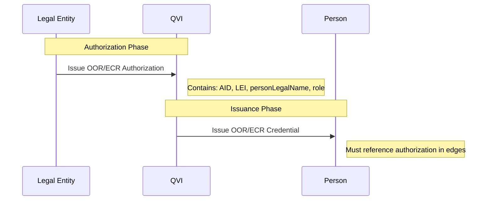

### 4. **Validation Chain**

To validate any credential, verifiers must:

1. Check the credential signature and status
2. Follow edge references up the chain
3. Validate each chained credential
4. Ensure unbroken chain to GLEIF root

## Critical Dependencies

### For QVI Operations

- **Required**: Valid QVI vLEI Credential from GLEIF
- **Enables**: Issuing LE credentials, OOR/ECR credentials (with auth)

### For Legal Entity Operations  

- **Required**: Valid LE vLEI Credential from QVI
- **Enables**: Issuing OOR/ECR Authorization credentials

### For Role Issuance

- **Required**: Valid Authorization credential from LE + Valid QVI credential
- **Enables**: Issuing role credentials to persons
# Credential Types

The vLEI ecosystem consists of six primary credential types that form a hierarchical trust chain:

## 1. QVI vLEI Credential

- **Schema SAID**: `EBfdlu8R27Fbx-ehrqwImnK-8Cm79sqbAQ4MmvEAYqao`
- **Issuer**: GLEIF (Global Legal Entity Identifier Foundation)
- **Recipient**: Qualified vLEI Issuers (QVIs)
- **Purpose**: Authorizes QVIs to issue Legal Entity vLEI credentials
- **Key Data**: LEI of the QVI organization, grace period (default 90 days)

## 2. Legal Entity vLEI Credential

- **Schema SAID**: `ENPXp1vQzRF6JwIuS-mp2U8Uf1MoADoP_GqQ62VsDZWY`
- **Issuer**: Qualified vLEI Issuer (QVI)
- **Recipient**: Legal Entity (LE)
- **Purpose**: Establishes the verified legal identity of an organization
- **Key Data**: LEI of the legal entity, chains to QVI credential

## 3. OOR Authorization vLEI Credential

- **Schema SAID**: `EKA57bKBKxr_kN7iN5i7lMUxpMG-s19dRcmov1iDxz-E`
- **Issuer**: Legal Entity (LE)
- **Recipient**: Qualified vLEI Issuer (QVI)
- **Purpose**: Authorizes QVI to issue Official Organizational Role credentials
- **Key Data**: Person's AID, role details, chains to LE credential

## 4. Official Organizational Role (OOR) vLEI Credential

- **Schema SAID**: `EBNaNu-M9P5cgrnfl2Fvymy4E_jvxxyjb70PRtiANlJy`
- **Issuer**: Qualified vLEI Issuer (QVI)
- **Recipient**: Person/Role Holder
- **Purpose**: Verifies a person's official role within an organization
- **Key Data**: Person's legal name, official role title, LEI reference

## 5. ECR vLEI Credential

- **Schema SAID**: `EEy9PkikFcANV1l7EHukCeXqrzT1hNZjGlUk7wuMO5jw`
- **Issuer**: Qualified vLEI Issuer (QVI)
- **Recipient**: Person/Role Holder
- **Purpose**: Verifies a person's engagement context role for specific interactions
- **Key Data**: Person's legal name, engagement role title, LEI reference, chains to ECR Auth

## 6. ECR Authorization vLEI Credential

- **Schema SAID**: `EH6ekLjSr8V32WyFbGe1zXjTzFs9PkTYmupJ9H65O14g`
- **Issuer**: Legal Entity (LE)
- **Recipient**: Qualified vLEI Issuer (QVI)
- **Purpose**: Authorizes QVI to issue Engagement Context Role credentials
- **Key Data**: Similar to OOR Auth but for engagement-specific roles
- **Special Feature**: Includes privacy disclaimer for IPEX/ACDC usage

## Trust Chain Flow

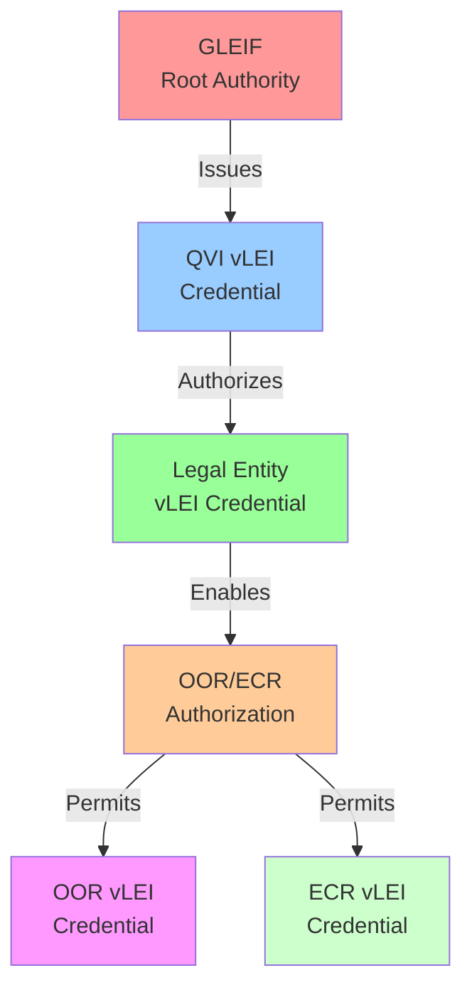

## Credential Issuance Sequence

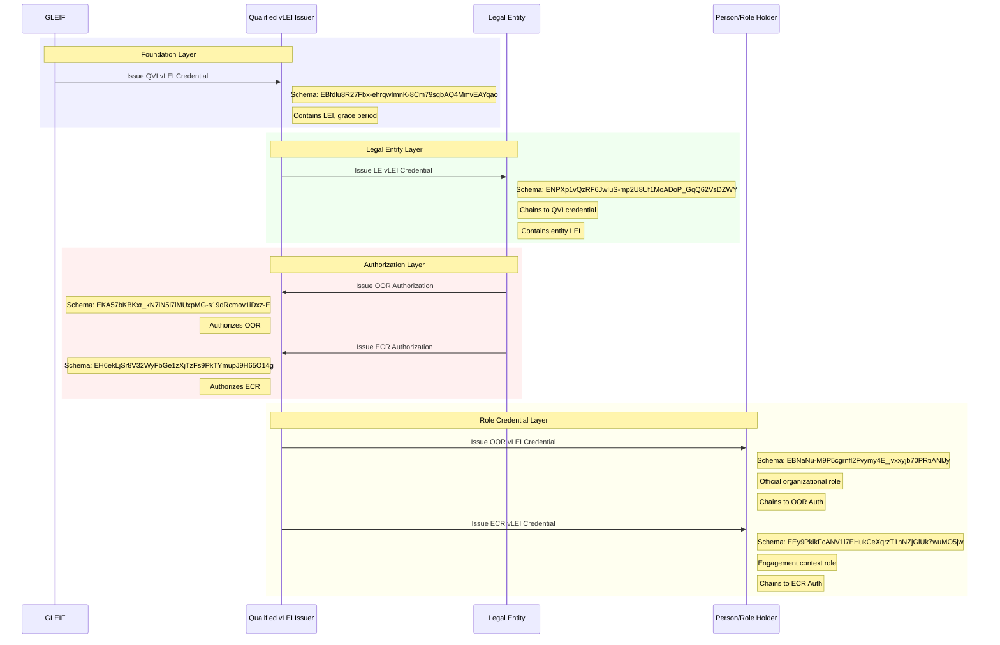

## Key Architecture Features

### Credential Chaining

- Each credential (except QVI) contains edges that reference its authorizing chained credential
- Creates a verifiable chain of authority from GLEIF down to individual roles9
- Enables cryptographic verification of the entire trust chain

### SAID-Based References

- All credential components use Self-Addressing Identifiers (SAIDs)
- Attributes and Rules can be either full objects or SAID string references
- Enables efficient storage and transmission while maintaining integrity

### Common Structure

All vLEI credentials share a common ACDC structure:

- **v**: Version string
- **d**: Credential SAID
- **u**: One-time use nonce (privacy-preserving metadata)
- **i**: Issuer AID
- **ri**: Credential status registry
- **s**: Schema SAID
- **a**: Attributes (content-specific)
- **e**: Edges (chaining relationships)
- **r**: Rules (usage and issuance disclaimers)

### Authorization Pattern

- Legal Entities issue authorization credentials to QVIs
- QVIs then issue role credentials to individuals
- Separates official roles (OOR) from engagement context roles (ECR)
- ECR includes additional privacy considerations for IPEX/ACDC usage

## Verification Process

To verify any credential in the ecosystem:

1. **Validate the credential structure** against its schema SAID
2. **Verify the issuer signature** using KERI
3. **Check the credential status** via an Observor deployemt monitoring Transaction Event Log staus
4. **Follow the edge references** to validate the chain of authority
5. **Verify each directed edge (chained credential)** recursively up to GLEIF

## Use Cases

- **Supply Chain Verification**: Verify the legal identity of trading partners
- **Digital Identity**: Establish organizational roles for digital interactions  
- **Regulatory Compliance**: Provide cryptographic proof of organizational authority
- **Selective Disclosure**: Share only necessary identity attributes
- **Cross-Border Commerce**: Enable trusted international business relationships
# Qualified vLEI Issuer (QVI) Credential Schema

## Schema Details

The QVI credential is the foundational credential in the vLEI ecosystem, issued directly by GLEIF to Qualified vLEI Issuers. This credential authorizes QVIs to issue Legal Entity vLEI credentials to organizations.

- **Schema SAID**: `EBfdlu8R27Fbx-ehrqwImnK-8Cm79sqbAQ4MmvEAYqao`
- **Version**: 1.0.0
- **Issuer**: GLEIF (Global Legal Entity Identifier Foundation)
- **Holder**: Qualified vLEI Issuer (QVI)

## Key Characteristics

- **Direct GLEIF Issuance**: Only GLEIF can issue QVI credentials
- **Delegation**: GLEIF MUST delegate the QVI AID
- **LEI Requirement**: QVI must have a valid Legal Entity Identifier
- **Status Registry**: Transaction Event Log maintains issuance status

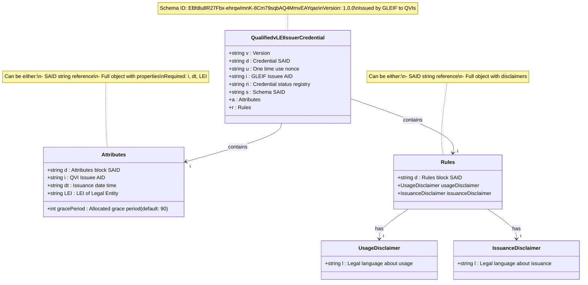
# Legal Entity vLEI Credential Schema

## Schema Details

The Legal Entity vLEI credential is issued by QVIs to organizations with valid Legal Entity Identifiers. This credential serves as the foundation for role-based credentials within an organization.

- **Schema SAID**: `ENPXp1vQzRF6JwIuS-mp2U8Uf1MoADoP_GqQ62VsDZWY`
- **Version**: 1.0.0
- **Issuer**: Qualified vLEI Issuer (QVI)
- **Holder**: Legal Entity (organization with LEI)

## Key Characteristics

- **LEI Verification**: Requires valid and active Legal Entity Identifier
- **QVI Chain**: Must be chained to issuer's QVI credential from GLEIF
- **Status Registry**: Transaction Event Log maintains issuance status
- **Edge References**: Cryptographically links to parent QVI credential
- **Foundation Credential**: Enables issuance of OOR and ECR Auth credentials

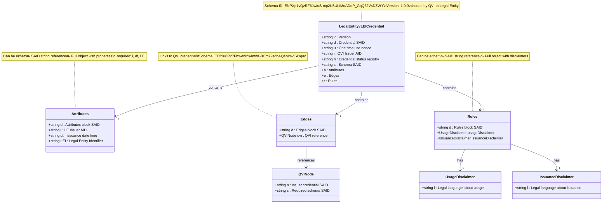
# OOR Authorization vLEI Credential Schema

## Schema Details

The OOR Authorization credential is issued by Legal Entities to QVIs, authorizing them to issue OOR credentials for official organizational roles within the organization.

- **Schema SAID**: `EKA57bKBKxr_kN7iN5i7lMUxpMG-s19dRcmov1iDxz-E`
- **Version**: 1.0.0
- **Issuer**: Legal Entity
- **Holder**: Qualified vLEI Issuer (QVI)
- **Purpose**: Authorize OOR credential issuance for official organizational roles

## Key Characteristics

- **Official Positions**: For permanent, formal organizational roles (CEO, CFO, Director, Manager)
- **Person Specification**: Includes AID and legal name of intended recipient
- **Role Description**: Specifies the official organizational role
- **Formal Hierarchy**: Represents official organizational structure
- **Edge Chaining**: Links to Legal Entity's vLEI credential

## Authorization Flow

### Issuance Process

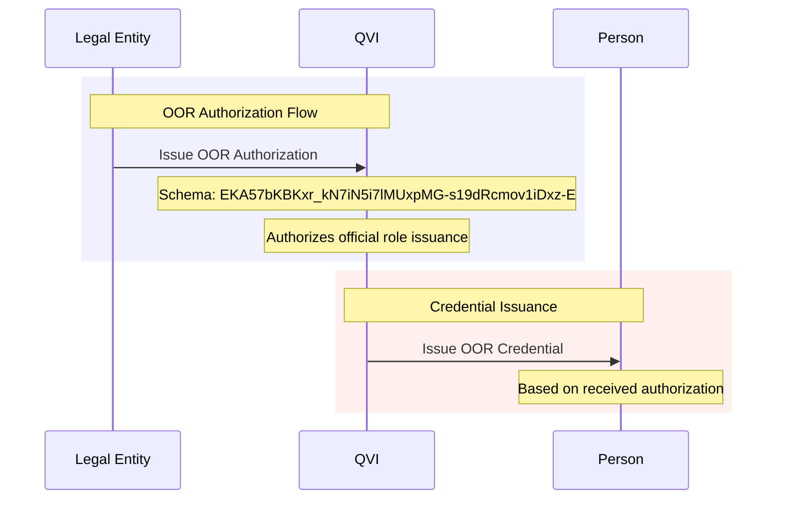

## Rules and Disclaimers

The OOR Authorization credential includes two disclaimer types:

- **Usage Disclaimer**: Legal language about credential usage rights and limitations
- **Issuance Disclaimer**: Terms and conditions for credential issuance

Note: Unlike ECR Authorization, OOR Authorization does not include a privacy disclaimer as it is intended for official organizational roles that are typically public.

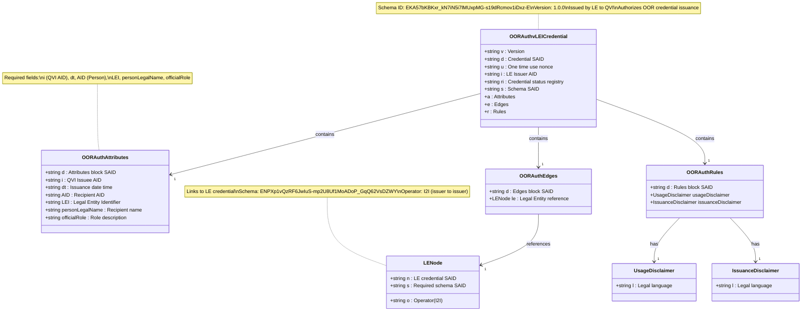
# ECR Authorization vLEI Credential Schema

## Schema Details

The ECR Authorization credential is issued by Legal Entities to QVIs, authorizing them to issue ECR credentials for specific engagement context roles within the organization.

- **Schema SAID**: `EH6ekLjSr8V32WyFbGe1zXjTzFs9PkTYmupJ9H65O14g`
- **Version**: 1.0.0
- **Issuer**: Legal Entity
- **Holder**: Qualified vLEI Issuer (QVI)
- **Purpose**: Authorize ECR credential issuance for engagement context roles

## Key Characteristics

- **Engagement-Specific**: For temporary, project-based, or consultancy roles
- **Person Specification**: Includes AID and legal name of intended recipient
- **Role Description**: Specifies the engagement context role
- **Privacy Considerations**: Includes privacy disclaimer for IPEX/ACDC usage
- **Edge Chaining**: Links to Legal Entity's vLEI credential

## Authorization Flow

### Issuance Process

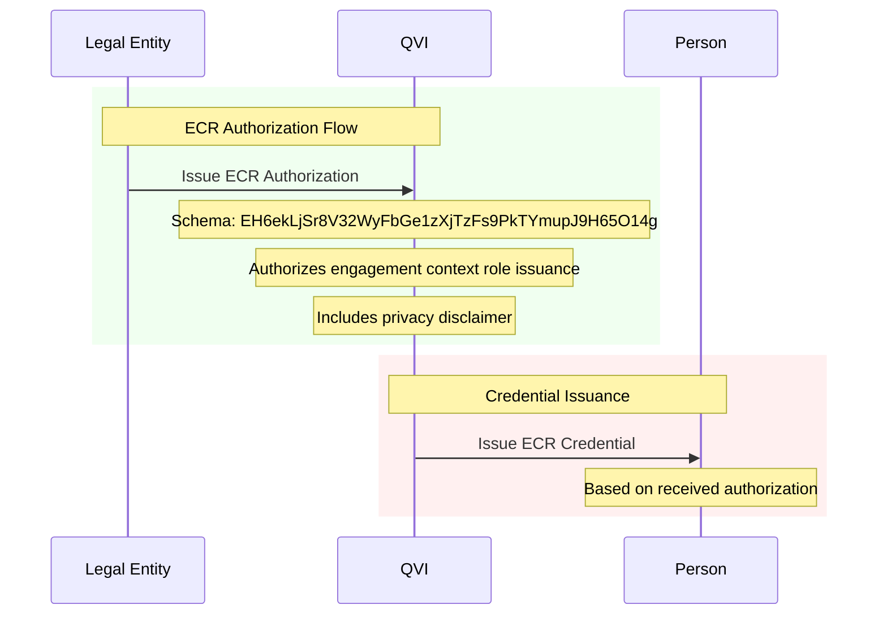

## Rules and Disclaimers

The ECR Authorization credential includes three disclaimer types:

- **Usage Disclaimer**: Legal language about credential usage rights and limitations
- **Issuance Disclaimer**: Terms and conditions for credential issuance
- **Privacy Disclaimer**: Privacy considerations for IPEX/ACDC usage (unique to ECR Auth)

The privacy disclaimer is specific to ECR Authorization credentials, acknowledging that engagement context roles may involve external parties requiring additional privacy protections.

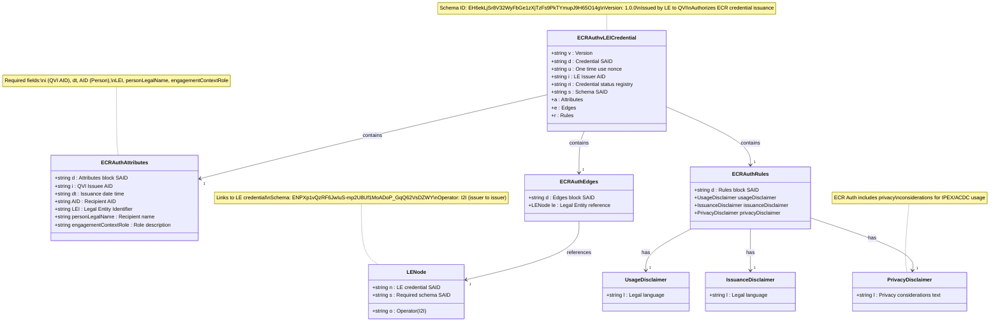
# Legal Entity Official Organizational Role (OOR) vLEI Credential Schema

## Schema Details

The OOR vLEI credential represents official organizational roles within a legal entity. These credentials are issued by QVIs to individuals holding formal positions in an organization.

- **Schema SAID**: `EBNaNu-M9P5cgrnfl2Fvymy4E_jvxxyjb70PRtiANlJy`
- **Version**: 1.0.0
- **Issuer**: Qualified vLEI Issuer (QVI)
- **Holder**: Individual with official organizational role
- **Authorization Required**: OOR Auth credential from Legal Entity

## Key Characteristics

- **Official Positions**: For formal organizational roles (CEO, CFO, Director, etc.)
- **LEI Binding**: Tied to organization's Legal Entity Identifier
- **Authorization Chain**: Requires OOR Auth from Legal Entity to QVI
- **Person Identification**: Links to individual's Autonomic Identifier (AID)
- **Role Specificity**: Uses `officialRole` field for position title

## Authorization Reference

The OOR vLEI Credential requires an OOR Authorization credential from the Legal Entity. This authorization allows the QVI to issue OOR credentials on behalf of the organization.

- **Auth Schema SAID**: `EKA57bKBKxr_kN7iN5i7lMUxpMG-s19dRcmov1iDxz-E`
- **Auth Type**: Issuer-to-Issuer (I2I) delegation
- See [OOR Auth Credential Schema](oor-auth-credential-schema) for details

## Issuance Process

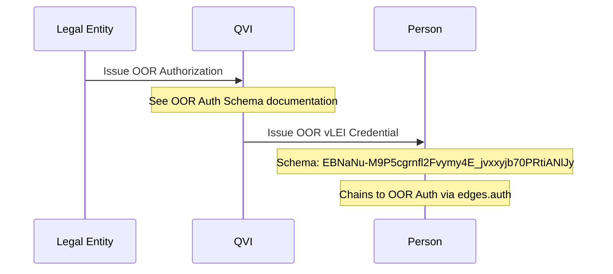

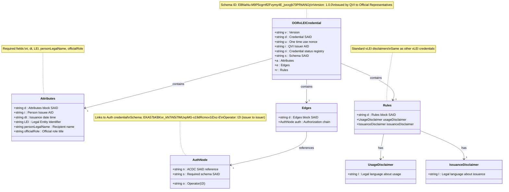
# Engagement Context Role (ECR) vLEI Credential Schema

## Schema Details

The ECR vLEI credential represents engagement context roles for individuals operating in specific project or consultancy contexts within or on behalf of a legal entity.

- **Schema SAID**: `EEy9PkikFcANV1l7EHukCeXqrzT1hNZjGlUk7wuMO5jw`
- **Version**: 1.0.0
- **Issuer**: Qualified vLEI Issuer (QVI)
- **Holder**: Individual with engagement context role
- **Authorization Required**: ECR Auth credential from Legal Entity

## Key Characteristics

- **Context-Specific**: For temporary or project-based engagements
- **Flexible Roles**: Uses `engagementContextRole` field for role description
- **Authorization Chain**: Requires ECR Auth from Legal Entity to QVI
- **LEI Binding**: Tied to organization's Legal Entity Identifier
- **Use Cases**: Consultancy, contractor roles, project teams, external engagements

## Authorization Reference

The ECR vLEI Credential requires an ECR Authorization credential from the Legal Entity. This authorization allows the QVI to issue ECR credentials for specific engagement contexts.

- **Auth Schema SAID**: `EH6ekLjSr8V32WyFbGe1zXjTzFs9PkTYmupJ9H65O14g`
- **Auth Type**: Issuer-to-Issuer (I2I)
- See [ECR Auth Credential Schema](ecr-auth-credential-schema) for details

## Issuance Process

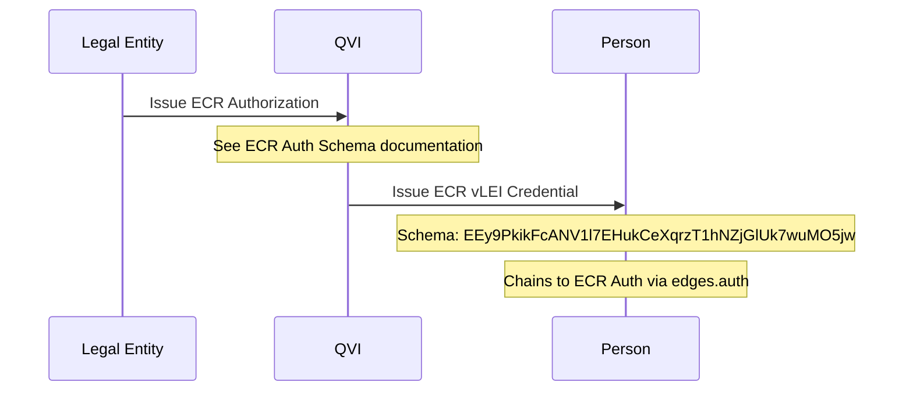

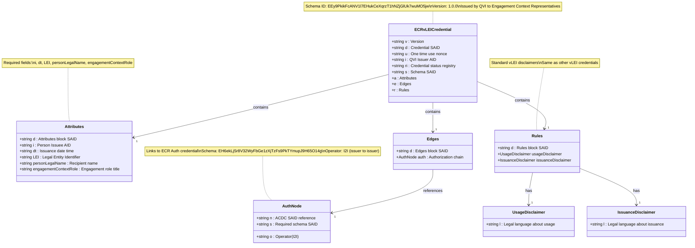
