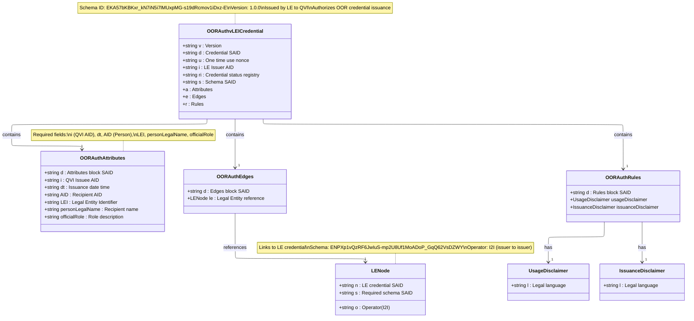
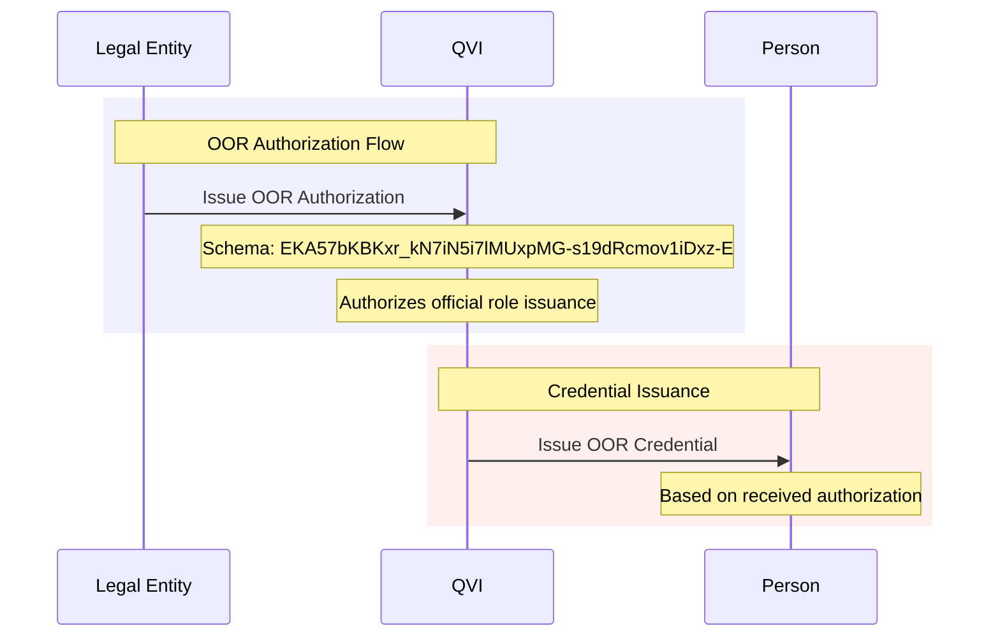

# OOR Authorization vLEI Credential Schema

## OOR Authorization vLEI Credential Structure

## Schema Details

- **Schema SAID**: `EKA57bKBKxr_kN7iN5i7lMUxpMG-s19dRcmov1iDxz-E`
- **Version**: 1.0.0
- **Issuer**: Legal Entity
- **Recipient**: QVI (Qualified vLEI Issuer)
- **Purpose**: Authorize OOR credential issuance for official organizational roles

## Key Characteristics

1. **For permanent, official organizational positions**
   - Examples: CEO, CFO, Director, Manager
   - Represents formal organizational hierarchy

2. **Required Attributes**:
   - `i`: QVI Issuee AID
   - `dt`: Issuance date time
   - `AID`: Recipient Person AID
   - `LEI`: Legal Entity Identifier
   - `personLegalName`: Recipient name
   - `officialRole`: Official role description

3. **Edge References**:
   - Links to Legal Entity credential
   - Uses I2I (issuer-to-issuer) operator
   - LE Schema: `ENPXp1vQzRF6JwIuS-mp2U8Uf1MoADoP_GqQ62VsDZWY`

## Authorization Flow

## Rules and Disclaimers

The OOR Authorization credential includes:
- **Usage Disclaimer**: Legal language about credential usage
- **Issuance Disclaimer**: Legal language about issuance terms

Note: Unlike ECR Authorization, OOR Authorization does not include a privacy disclaimer as it is intended for official organizational roles that are typically public.