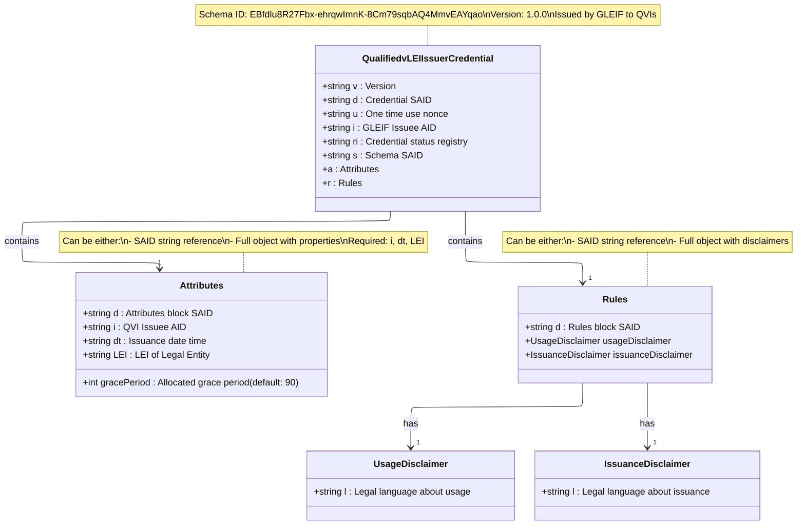

```mermaid
---
config:
  layout: elk
---
classDiagram
    class QualifiedvLEIIssuerCredential {
        +string v : Version
        +string d : Credential SAID
        +string u : One time use nonce
        +string i : GLEIF Issuee AID
        +string ri : Credential status registry
        +string s : Schema SAID
        +a : Attributes
        +r : Rules
    }

    class Attributes {
        +string d : Attributes block SAID
        +string i : QVI Issuee AID
        +string dt : Issuance date time
        +string LEI : LEI of Legal Entity
        +int gracePeriod : Allocated grace period (default: 90)
    }

    class Rules {
        +string d : Rules block SAID
        +UsageDisclaimer usageDisclaimer
        +IssuanceDisclaimer issuanceDisclaimer
    }

    class UsageDisclaimer {
        +string l : Legal language about usage
    }

    class IssuanceDisclaimer {
        +string l : Legal language about issuance
    }

    QualifiedvLEIIssuerCredential --> "1" Attributes : contains
    QualifiedvLEIIssuerCredential --> "1" Rules : contains
    Rules --> "1" UsageDisclaimer : has
    Rules --> "1" IssuanceDisclaimer : has

    note for QualifiedvLEIIssuerCredential "Schema ID: EBfdlu8R27Fbx-ehrqwImnK-8Cm79sqbAQ4MmvEAYqao\nVersion: 1.0.0\nIssued by GLEIF to QVIs"
    
    note for Attributes "Can be either:\n- SAID string reference\n- Full object with properties\nRequired: i, dt, LEI"
    
    note for Rules "Can be either:\n- SAID string reference\n- Full object with disclaimers"
```