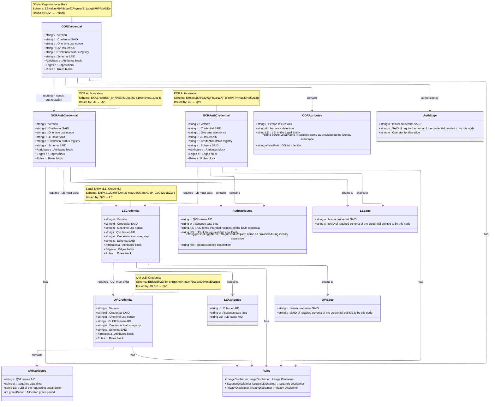
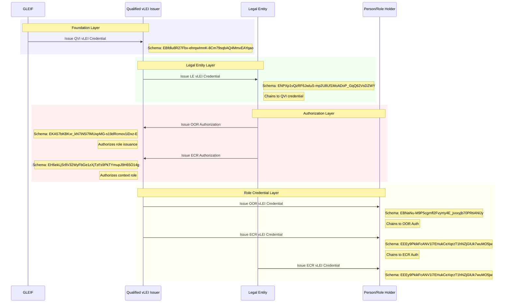

# vLEI Credential Ecosystem - Dependencies and Schema Relationships

## Credential Issuance Flow

## Key Design Patterns

### 1. Credential Chaining

- Each credential (except QVI) references its chained credentials through edges
- Ensures verifiable chain of authority from GLEIF down to individual roles

### 2. Compact credentials

- Attributes and Rules can be either:
  - Full objects with all properties
  - SAIDs for compactness

### 3. Common Rules Structure

- All credentials share similar disclaimer structure
- ECR Authorization adds privacy disclaimer for IPEX/ACDC

### 4. Authorization Pattern

- Legal Entities authorize QVIs to issue role credentials
- Separates OOR (official roles) from ECR (engagement context roles)

### 5. Legal Entities as issues

- Legal Entities can issue their own ECR credentials without a preceeding auth
